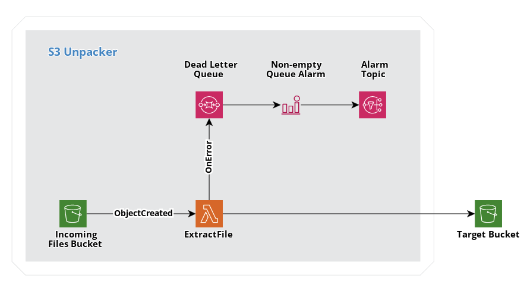

# S3 Unpacker

S3 Unpacker automatically extracts zip files as they are created in an S3 bucket, leveraging AWS Lambda.

## Features

* Automatic extraction of zip files into a bucket of your choice.
* Dead letter queue to keep track of failed executions.
* CloudWatch alarm to be notified about existing entries in the dead letter queue.

## How it works

The project was built using [AWS SAM (Serverless Application Model)](https://docs.aws.amazon.com/serverless-application-model/latest/developerguide/what-is-sam.html). It contains two main components:

* An S3 bucket to ingest zip files.
* A Node.js Lambda function that extracts zip files into a different S3 bucket.



The Lambda function is triggered every time a new file with the `.zip` extension is created in the bucket. Its content is uploaded into the target S3 bucket, placed into the same path as the original file, within a folder with the same name as the file without the `.zip` extension (for example, the file `foo/bar/baz.zip` would be extracted into `foo/bar/baz/`). In case of failure, the event is sent to a dead letter queue. A CloudWatch alarm is triggered when the queue is not empty, and a notification is sent out to an SNS topic when that happens.

It's worth noting that the Lambda function is using [reserved concurrency](https://docs.aws.amazon.com/lambda/latest/dg/configuration-concurrency.html). It sets a top limit for the amount of files that can be processed simultaneously, but it prevents the AWS region's Lambda concurrency from being maxed-out due to spikes.

## Deploy the application

S3 Unpacker can be deployed with one click from the [AWS Serverless Application Repository](https://serverlessrepo.aws.amazon.com/applications/eu-west-1/060072498088/s3-unpacker). It can be also deployed from your local machine, following the steps below.

### Prerequisites

You'll need the following tools to deploy the application:

* AWS SAM CLI - [Install the AWS SAM CLI](https://docs.aws.amazon.com/serverless-application-model/latest/developerguide/serverless-sam-cli-install.html).
* Node.js - [Install Node.js](https://nodejs.org/en/), including npm.
* Docker - [Install Docker community edition](https://hub.docker.com/search/?type=edition&offering=community).

### Deployment

To build and deploy s3 for the first time, run the following in your shell:

```bash
sam build
sam deploy --guided
```

The first command will build the source of your application. The second command will package and deploy your application to AWS, with a series of prompts, such as the CloudFormation stack name or the AWS region where the resources should be created. It also requests the following parameters:

* `IncomingFilesBucketName`: name of the bucket where zip files will be uploaded. A new bucket with this name will be created, so it cannot exist.
* `TargetBucketName`: name of the bucket where zip files should be extracted to. his bucket will not be created, it must exist.
* `ExtractFileFunctionMemory`: amount of memory available to the Lambda function. Default: 128MB.
* `ExtractFileFunctionReservedConcurrency`: reserved concurrency for the Lambda function. It determines the maximum number of files that can be processed simultaneously, and it prevents the AWS account concurrency from being maxed-out.

### Outputs

The resulting CloudFormation stack provides the following outputs:

* `IncomingFilesBucketName`: name of the S3 bucket where zip files are expected.
* `ExtractFileDlqUrl`: URL of the SQS queue that keeps track of failed Lambda executions.
* `ExtractFileDlqAlertTopicArn`: ARN of the SNS topic where the messages notifying about new messages in the dead letter queue will be published.

## Cleanup

To delete the application, use the AWS CLI.

```bash
s3-unpacker$ aws cloudformation delete-stack --stack-name s3-unpacker
```
